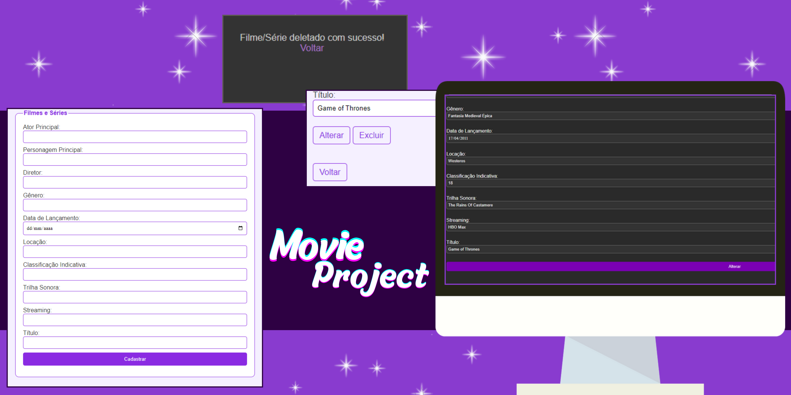

# CRUD Project in PHP with MySQL
This is a basic CRUD (Create, Read, Update, Delete) system project in PHP, enabling the management of movies within a MySQL database through a simple web application.

  ##
  
## Prerequisites
- Local web server (such as XAMPP, WAMP, or MAMP) configured.
- Installed MySQL.
- Basic knowledge of PHP and MySQL.

## Installation and Configuration
1. Clone or download this repository.
2. Import the `database.sql` file to create the database structure and tables.
3. Configure the database credentials in the `connect.php` file.

## Features
### 1. List Movies
- `listDateMovies.php`: Lists all the movies registered in the database.

### 2. Insert Movie
- `insertDateMovies.php`: Allows the addition of a new movie to the database.

### 3. Update Movie
- `alterDateMovies.php`: Enables updating the details of an existing movie in the database.

### 4. Delete Movie
- `deleteDateMovies.php`: Removes a movie from the database.

## Development Environment Setup
1. Set up a local web server (XAMPP, WAMP, MAMP).
2. Clone or download this repository into the local server directory.
3. Import the `database.sql` file to create the database and its tables.
4. Configure the database credentials in the `connect.php` file.
5. Access the application via a web browser.

## Project Structure
- `index.php`: Project's homepage.
- `listDateMovies.php`: Lists all registered movies.
- `insertDateMovies.php`: Form to insert a new movie.
- `alterDateMovies.php`: Form to update details of an existing movie.
- `deleteDateMovies.php`: Removes a movie from the database.
- `connect.php`: Database connection file.
- `css/`: Directory containing CSS files for styling.

## Technologies Used
- PHP
- MySQL
- HTML
- CSS

# License
This project is licensed under the MIT License.

# Contributions
Contributions are welcome! Feel free to open a pull request or report any issues encountered.

# Credits
Crafted with care by Julia Faria.
